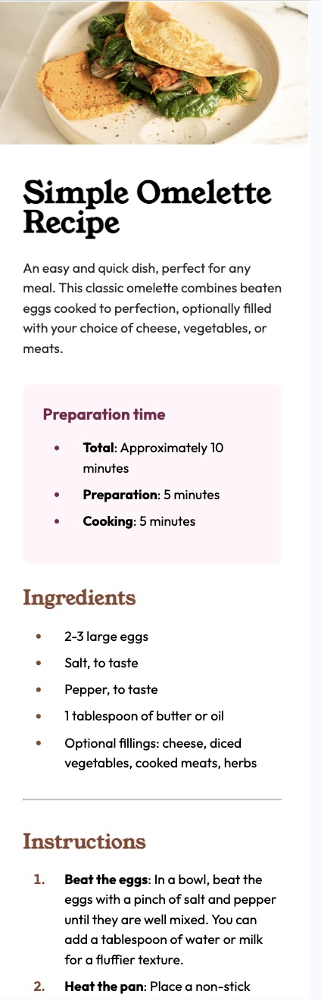
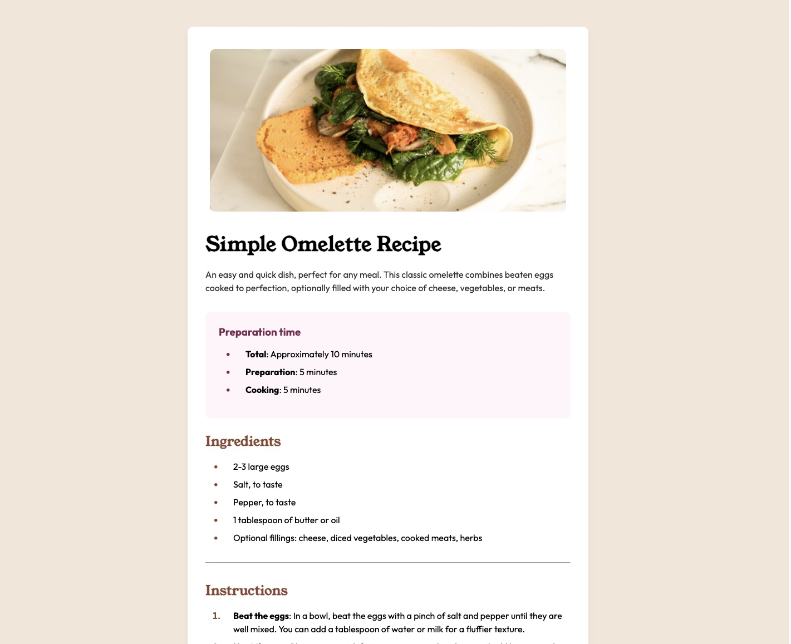

# Frontend Mentor - Recipe page solution

This is a solution to the [Recipe page challenge on Frontend Mentor](https://www.frontendmentor.io/challenges/recipe-page-KiTsR8QQKm). Frontend Mentor challenges help you improve your coding skills by building realistic projects.

## Table of contents

- [Overview](#overview)
  - [The challenge](#the-challenge)
  - [Screenshot](#screenshot)
  - [Links](#links)
- [My process](#my-process)
  - [Built with](#built-with)
  - [What I learned](#what-i-learned)
  - [Continued development](#continued-development)

## Overview

### Screenshot




### Links

- Solution URL: [Add solution URL here](https://github.com/Ayako-Yokoe/recipe-page-main)
- Live Site URL: [Add live site URL here](https://recipe-page-three-mauve.vercel.app/)

## My process

### Built with

- Semantic HTML5 markup
- CSS custom properties
- CSS Grid
- Mobile-first workflow

### What I learned

I learned how to properly align the bullet points and numbers in lists, along with the long texts associated with each list item.

```css
ul,
ol {
  list-style-position: outside;
  padding-left: 10px;
  margin: 0;
}
ul li,
ol li {
  font-family: var(--font-family-secondary);
  line-height: 1.5;
  margin-bottom: 8px;
  margin-left: 20px;
  padding-left: 20px;
}
```

### Continued development

This time, I applied a mobile-first strategy. I'm aiming to become more comfortable with this approach as I continue developing apps.

# recipe-page-main
